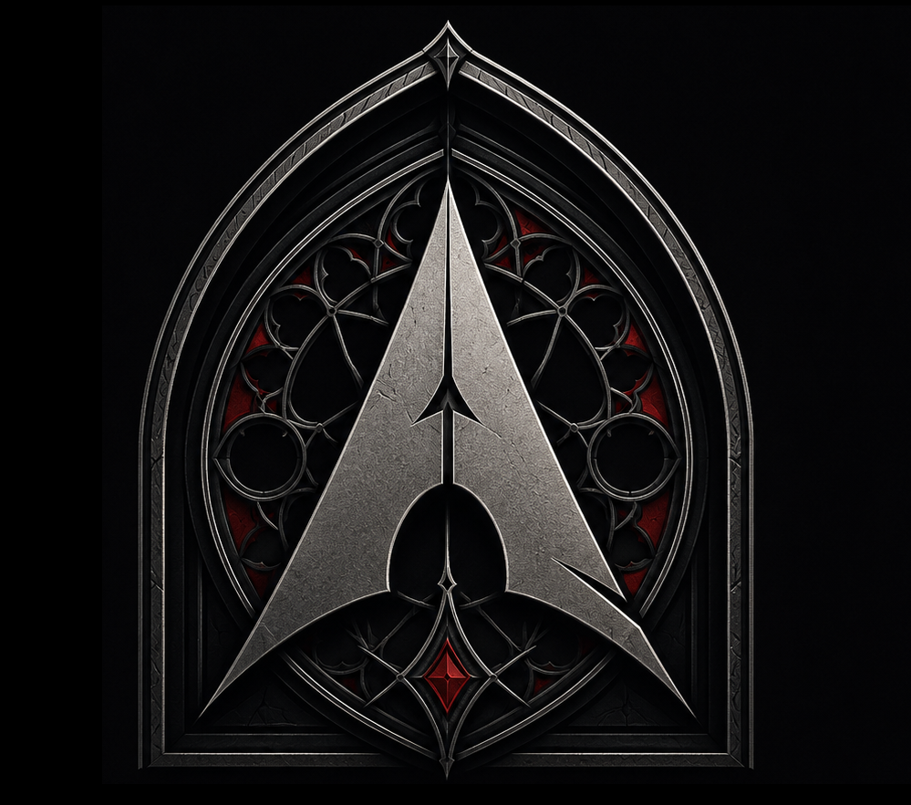
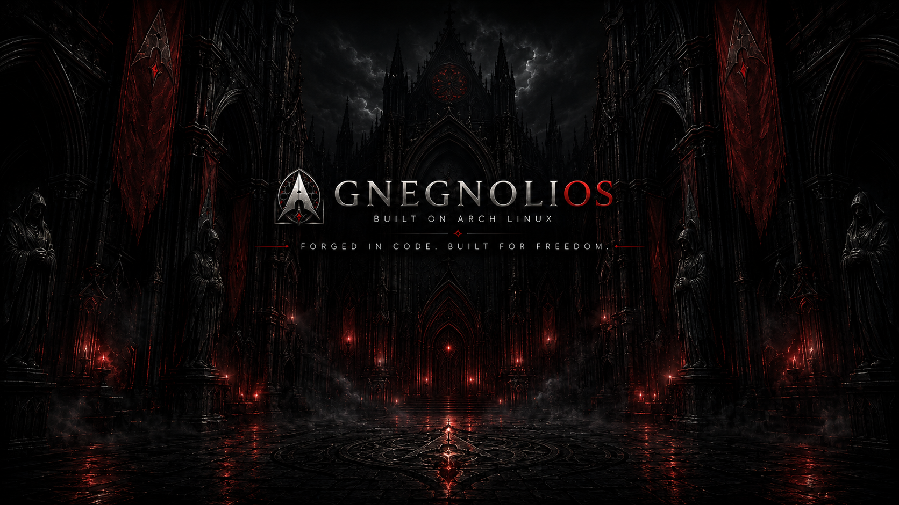
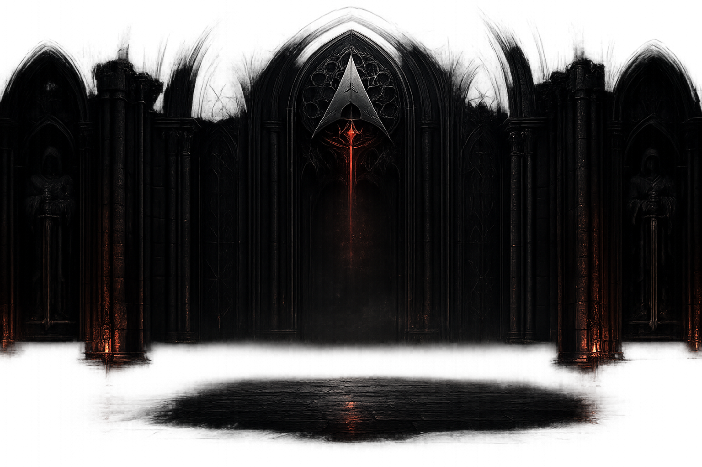

<div align="center">



# GnegnoliOS

### Power. Elegance. Darkness. Precision.

**A premium Arch Linux distribution, built for professionals — not another generic Arch derivative.**

[](https://archlinux.org)
[](#desktop-environments)
[](#)
[](#)
[](#)

</div>

<br/>

<div align="center">

<sub>Default wallpaper — <b>Genesis</b></sub>
</div>

<br/>

## What it is

**GnegnoliOS** is a Linux distribution based on **Arch Linux**, built to feel like a product from a serious technology company: solid, trustworthy, restrained, visually unmistakable — from the very first boot.

This isn't a remaster with a different wallpaper. It's a system with **its own identity, curated defaults, and a deliberate product experience** — from the boot splash to the installer, from the terminal theme to the ISO itself.

> "The logo carries the brand. GnegnoliOS does not need a mascot."

## Goals

- **Zero friction from first boot.** Drivers, firmware, codecs, snapshots, power management: work out of the box.
- **One smart installer.** Not an endless checklist — curated modes (Express / Guided / Advanced) covering developers, gamers, creators, sysadmins, enterprise users.
- **Single source of truth.** Every component derives its configuration from [`config/distro.yaml`](config/distro.yaml) — no duplication, automation wherever possible.
- **One consistent visual identity across every surface**: logo, GRUB, Plymouth, SDDM, Plasma, cursors, terminal, Firefox, Calamares, website, documentation.
- **Built for people who actually work on the machine**: developers, sysadmins, musicians, creators, streamers, video editors, power users, businesses.

## Who it's for

| | | | |
|---|---|---|---|
| 👨‍💻 Developers | 🛠️ Power users | 🖥️ SysAdmins | 🎚️ Musicians |
| 🎬 Content creators | 📡 Streamers | ✂️ Video editors | 🏢 Enterprise |

## Technical baseline

| Component | Choice |
|---|---|
| Base | Arch Linux |
| Package manager | `pacman` + `yay` (AUR) |
| Kernel | `linux`, `linux-lts`, `linux-zen` |
| Desktop | 14 environments, picked at build time — see below |
| Display manager | per desktop (SDDM, GDM, LightDM, ...) |
| Filesystem | Btrfs + Snapper |
| Bootloader | GRUB |
| Init | systemd |
| Audio | PipeWire |
| Firewall | ufw |
| Installer | Calamares + Smart Installer Catalog |
| Sandboxing | Flatpak |

## Desktop environments

GnegnoliOS is **multiplatform across desktop environments**: the ISO isn't
built once for KDE, it's built once *per desktop*, selected interactively
when you run `./scripts/build.sh`. Each desktop is a self-contained profile
under [`profiles/desktops/`](profiles/desktops/) declaring its packages,
display manager, session name, and default apps (terminal, file manager,
editor, screenshot tool). Every desktop also gets its own branding package
(`packages/gnegnolios-branding-<desktop>/`) so the GnegnoliOS visual identity
(wallpapers, SDDM/LightDM/GDM theme, icons, color palette) is adapted to fit
that DE's theming system rather than reused as-is.

The build engine ([`scripts/lib/build-engine.sh`](scripts/lib/build-engine.sh),
[`scripts/lib/profile-engine.sh`](scripts/lib/profile-engine.sh)) reads the
chosen desktop's YAML, merges its packages on top of the base package set
and selected kernel/feature profiles, wires up its display manager, and
names the resulting ISO `gnegnolios-<desktop>-*.iso`. `config/distro.yaml`
lists the available desktops and the default (`kde`); adding a new desktop
means adding one `profiles/desktops/<id>.yaml` file plus a matching branding
package — no changes to the build engine itself.

| Desktop | Status | Display manager | Notes |
|---|---|---|---|
| KDE Plasma | stable | SDDM | default |
| GNOME | stable | GDM | |
| XFCE | stable | LightDM | |
| Cinnamon | stable | LightDM | |
| MATE | stable | LightDM | |
| LXQt | stable | SDDM | |
| Budgie | stable | LightDM | |
| Hyprland | stable | SDDM | Wayland compositor, not a full DE |
| COSMIC | experimental | cosmic-greeter | AUR-only packages, breaking changes upstream |
| Deepin | experimental | LightDM | needs deepin-community repo in `pacman.conf` |
| Pantheon | experimental | LightDM | AUR-only, not buildable via `mkarchiso` alone |
| ROX Desktop | experimental | LightDM | unmaintained upstream, AUR-only |
| LXDE | experimental | LXDM | superseded by LXQt, AUR-only |
| Trinity (TDE) | experimental | TDM | KDE 3 fork, own unofficial repo |

"Experimental" means the profile exists and is wired into the build, but its
packages come from AUR/third-party repos that `mkarchiso`'s
`packages.x86_64` mechanism can't resolve on its own — building those
desktops into a bootable ISO currently requires pre-populating the local
pacman repo with an AUR helper first. `./scripts/build.sh` still builds and
warns rather than blocking, so this is a packaging limitation, not a
missing feature.

## Visual identity

<div align="center">


<br/>
<sub>Login screen (SDDM) — Boot splash (Plymouth)</sub>
</div>

The visual language blends corporate minimalism, gothic architectural geometry, forged steel, volcanic stone, black marble — a restrained dark-fantasy atmosphere, never horror, never neon, never cyberpunk.

**Palette**

| Token | | Hex | Use |
|---|---|---|---|
| Matte Black |  | `#0D0D0D` | Primary background |
| Charcoal |  | `#1B1B1B` | Raised surfaces |
| Steel |  | `#323232` | Dividers |
| Graphite |  | `#4D4D4D` | Muted controls |
| Dark Crimson |  | `#7A0F16` | Accent, focus, progress |
| Metal Silver |  | `#A8A8A8` | Secondary text |
| White |  | `#EDEDED` | Primary text |

Full details in [`docs/BRAND_SYSTEM.md`](docs/BRAND_SYSTEM.md).

## Repository layout

```
GnegnoliOS/
├── applications/    # apps developed for GnegnoliOS (Control Center, ...)
├── config/          # distro.yaml — single source of truth, installer.yaml — Smart Installer catalog
├── distro/          # archiso profile, everything needed to generate the ISO
├── packages/        # custom packages: one branding package per desktop, calamares-config, installer-config, release, control-center...
├── profiles/        # desktop / kernel / feature package sets, combined at build time (profiles/desktops/*.yaml)
├── calamares/        # installer configuration
├── scripts/         # build engine (scripts/lib/*.sh)
└── docs/            # architecture, brand system, product brief, smart installer
```

Full architecture in [`docs/ARCHITECTURE.md`](docs/ARCHITECTURE.md).

## Smart Installer

Calamares driven by a declarative catalog ([`config/installer.yaml`](config/installer.yaml)) with three modes:

- **Express** — ready-to-use system, no questions asked.
- **Guided** *(recommended)* — smart per-category profiles (browsers, dev, gaming, virtualization, drivers...).
- **Advanced** — granular control over filesystem, kernel, bootloader, services, packages.

Details in [`docs/SMART_INSTALLER.md`](docs/SMART_INSTALLER.md).

## Build

### Prerequisites

Build from an Arch Linux host (or an Arch container/VM — `mkarchiso` needs a
real Arch environment, not just any Linux):

```bash
sudo pacman -S --needed archiso base-devel yq
```

- `archiso` — provides `mkarchiso` and the archiso profile tooling
- `base-devel` — provides `makepkg` to build the custom packages
- `yq` — reads `config/distro.yaml` and every `package.yaml`
- `sudo` access — `mkarchiso` runs as root (chroot, squashfs, etc.)

### Build the ISO

```bash
git clone https://github.com/Gnegnoli/GnegnoliOS.git
cd GnegnoliOS
./scripts/build.sh
```

The build:
1. loads `config/distro.yaml` and validates the configuration;
2. prompts you to pick a desktop environment from `profiles/desktops/` (see [Desktop environments](#desktop-environments));
3. composes the package list from `profiles/base.yaml` + the chosen desktop, kernel, and feature profiles;
4. compiles the custom packages in `packages/` (those with `enabled: true` and `build: true` in their `package.yaml`), including the desktop-specific branding package, and publishes them to a local pacman repository;
5. generates the ISO via `mkarchiso`, named `gnegnolios-<desktop>-*.iso`.

Build layout (all under `build/`, gitignored):

| Path | Content |
|---|---|
| `build/profile/` | assembled archiso workspace (`packages.x86_64`, airootfs, etc.) |
| `build/cache/` | `mkarchiso` work directory (safe to delete, rebuilt each run) |
| `build/output/` | final ISO — `gnegnolios-*.iso` |

Rebuilding after a package or config change re-runs the whole pipeline; there's
no incremental package build yet (see TODO below).

### Test the ISO

```bash
qemu-system-x86_64 -enable-kvm -m 4096 -cdrom build/output/gnegnolios-*.iso
```

Or flash it to a USB drive with `dd`/Ventoy/Rufus and boot real hardware.

Default live session credentials (both `root` and the `live` user):

| User | Password |
|---|---|
| `live` | `live` |
| `root` | `live` |

## TODO / planned features

Rough backlog, not yet scheduled — mainly for the Control Center app
(`applications/control-center/`), which currently has several "Not available"
placeholders:

- [ ] Package picker (search + multi-select) for Install/Remove Packages
- [ ] Add Repo dialog (name, URL, signature policy → append to `pacman.conf`)
- [ ] Proton/Kernel version picker (list installed, pick default, remove)
- [ ] Snapshot restore flow (list snapper snapshots, confirm, rollback)
- [ ] Controller Setup page (detect gamepads, map profiles)
- [ ] MangoHud config toggle (edit `MangoHud.conf`, not just launch it)
- [ ] Driver Manager page (detect GPU, offer proprietary/open switch)
- [ ] Theming pages (Themes/Icons/Wallpapers/Fonts — currently stubs)
- [ ] Settings page (General/Notifications/Appearance — currently stubs)
- [ ] i18n: translate UI strings per system locale (currently English-only)
- [ ] Incremental package builds in `scripts/build.sh` (skip unchanged packages)

## Project status

`v0.1-alpha` — active development. Structure, branding, and build engine are stable; installer and profiles are still expanding.

<div align="center">
<br/>
<sub>GnegnoliOS — built to actually be used.</sub>
</div>
