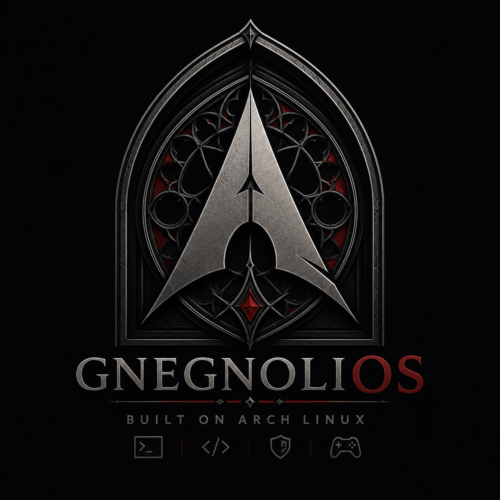
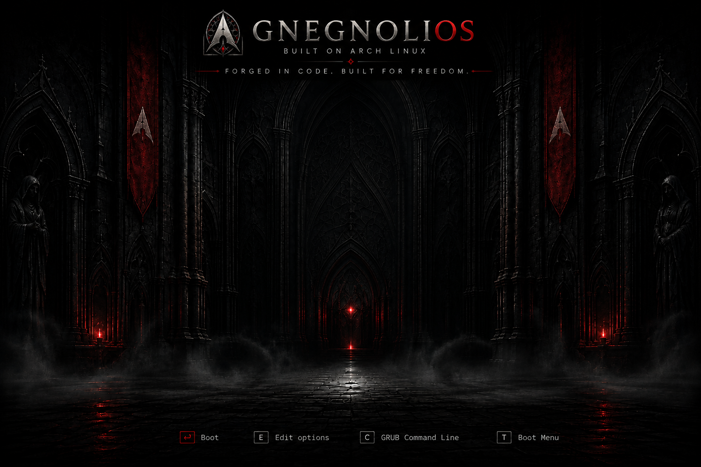
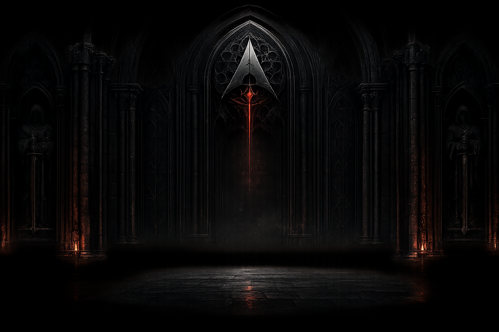
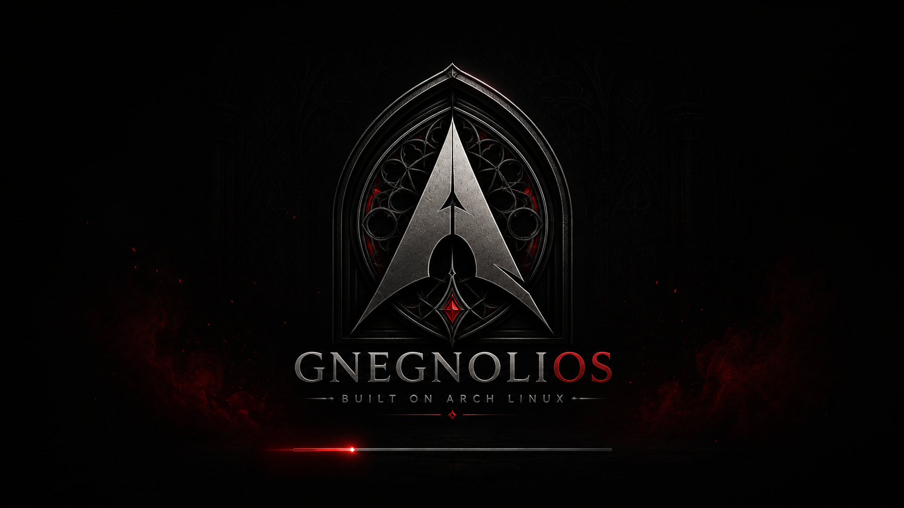

<div align="center">



# GnegnoliOS

### Power. Elegance. Darkness. Precision.

**A premium Arch Linux distribution, built for professionals — not another generic Arch derivative.**

[](https://archlinux.org)
[](https://kde.org)
[](#)
[](#)
[](#)

</div>

<br/>

<div align="center">

<sub>Default wallpaper — <b>Genesis</b></sub>
</div>

<br/>

## What it is

**GnegnoliOS** is a Linux distribution based on **Arch Linux**, built to feel like a product from a serious technology company: solid, trustworthy, restrained, visually unmistakable — from the very first boot.

This isn't a remaster with a different wallpaper. It's a system with **its own identity, curated defaults, and a deliberate product experience** — from the boot splash to the installer, from the terminal theme to the ISO itself.

> "The logo carries the brand. GnegnoliOS does not need a mascot."

## Goals

- **Zero friction from first boot.** Drivers, firmware, codecs, snapshots, power management: work out of the box.
- **One smart installer.** Not an endless checklist — curated modes (Express / Guided / Advanced) covering developers, gamers, creators, sysadmins, enterprise users.
- **Single source of truth.** Every component derives its configuration from [`config/distro.yaml`](config/distro.yaml) — no duplication, automation wherever possible.
- **One consistent visual identity across every surface**: logo, GRUB, Plymouth, SDDM, Plasma, cursors, terminal, Firefox, Calamares, website, documentation.
- **Built for people who actually work on the machine**: developers, sysadmins, musicians, creators, streamers, video editors, power users, businesses.

## Who it's for

| | | | |
|---|---|---|---|
| 👨‍💻 Developers | 🛠️ Power users | 🖥️ SysAdmins | 🎚️ Musicians |
| 🎬 Content creators | 📡 Streamers | ✂️ Video editors | 🏢 Enterprise |

## Technical baseline

| Component | Choice |
|---|---|
| Base | Arch Linux |
| Package manager | `pacman` + `yay` (AUR) |
| Kernel | `linux`, `linux-lts` |
| Desktop | KDE Plasma (Wayland) |
| Display manager | SDDM |
| Filesystem | Btrfs + Snapper |
| Bootloader | GRUB |
| Init | systemd |
| Audio | PipeWire |
| Firewall | ufw |
| Installer | Calamares + Smart Installer Catalog |
| Sandboxing | Flatpak |

## Visual identity

<div align="center">


<br/>
<sub>Login screen (SDDM) — Boot splash (Plymouth)</sub>
</div>

The visual language blends corporate minimalism, gothic architectural geometry, forged steel, volcanic stone, black marble — a restrained dark-fantasy atmosphere, never horror, never neon, never cyberpunk.

**Palette**

| Token | | Hex | Use |
|---|---|---|---|
| Matte Black |  | `#0D0D0D` | Primary background |
| Charcoal |  | `#1B1B1B` | Raised surfaces |
| Steel |  | `#323232` | Dividers |
| Graphite |  | `#4D4D4D` | Muted controls |
| Dark Crimson |  | `#7A0F16` | Accent, focus, progress |
| Metal Silver |  | `#A8A8A8` | Secondary text |
| White |  | `#EDEDED` | Primary text |

Full details in [`docs/BRAND_SYSTEM.md`](docs/BRAND_SYSTEM.md).

## Repository layout

```
GnegnoliOS/
├── config/          # distro.yaml — single source of truth, installer.yaml — Smart Installer catalog
├── distro/          # archiso profile, everything needed to generate the ISO
├── packages/        # custom packages (branding, calamares-config, installer-config, release...)
├── profiles/        # desktop / kernel / feature package sets, combined at build time
├── calamares/        # installer configuration
├── scripts/         # build engine (scripts/lib/*.sh)
└── docs/            # architecture, brand system, product brief, smart installer
```

Full architecture in [`docs/ARCHITECTURE.md`](docs/ARCHITECTURE.md).

## Smart Installer

Calamares driven by a declarative catalog ([`config/installer.yaml`](config/installer.yaml)) with three modes:

- **Express** — ready-to-use system, no questions asked.
- **Guided** *(recommended)* — smart per-category profiles (browsers, dev, gaming, virtualization, drivers...).
- **Advanced** — granular control over filesystem, kernel, bootloader, services, packages.

Details in [`docs/SMART_INSTALLER.md`](docs/SMART_INSTALLER.md).

## Build

```bash
./scripts/build.sh
```

The build:
1. loads `config/distro.yaml` and validates the configuration;
2. composes the package list from `profiles/base.yaml` + selected desktop, kernel, and feature profiles;
3. compiles the custom packages in `packages/` and publishes them to a local pacman repository;
4. generates the ISO via `mkarchiso`.

Output lands in `build/output/gnegnolios-*.iso`.

## Project status

`v0.1-alpha` — active development. Structure, branding, and build engine are stable; installer and profiles are still expanding.

<div align="center">
<br/>
<sub>GnegnoliOS — built to actually be used.</sub>
</div>
